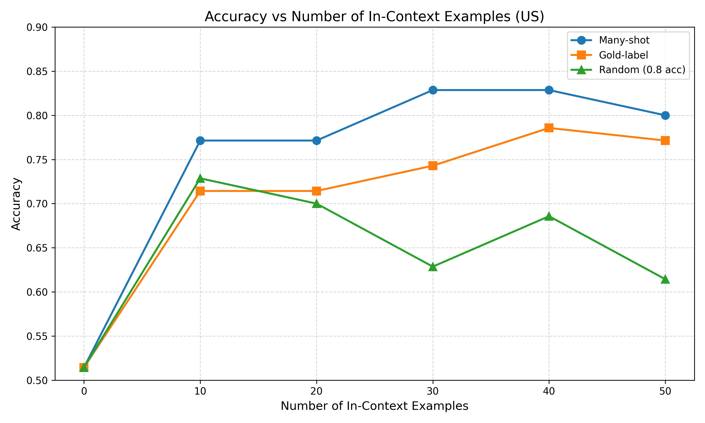
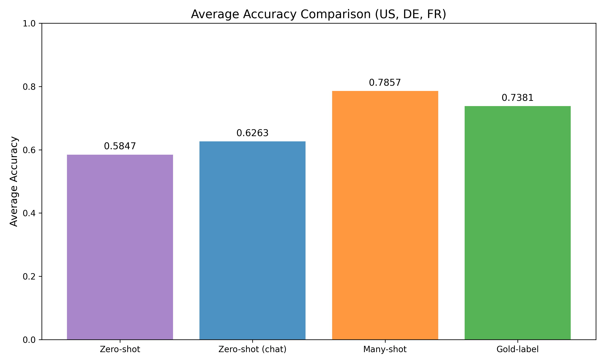

## Unsupervised Persona Elicitation

In this project, we apply the ICM algorithm to elicit personas from global opinions.

## Results and Report
### Report
Report: [doc/presona_elicitation_report.pdf](doc/presona_elicitation_report.pdf)
### Results
<p align="center">
  
</p>

<p align="center">
  
</p>

## Note
### Datasets:
- Question with Binary Options: 440
- Germany: 203
- United States: 199
- France: 197


## Setup
Before running the code, you need to add your API key to the SECRETS file.
### Run
```commandline
uv run ./src/experiments/ICM.py --testbed global_opinions --model meta-llama/Meta-Llama-3.1-405B --K 120 --country US
```
### Evaluation
US (many-shot)
```commandline
uv run src/experiments/ICM.py --mode test --testbed global_opinions --country US --test_mode many-shot --test_data_path data/labeled_global_opinions_US.json --batch_size 4 --num_shots 50
```
US (gold-label)
```commandline
uv run src/experiments/ICM.py --mode test --testbed global_opinions --country US --test_mode gold-label --test_data_path data/labeled_global_opinions_US.json --batch_size 4 --num_shots 50
```
DE
```commandline
uv run src/experiments/ICM.py --mode test --testbed global_opinions --country DE --test_mode gold-label --test_data_path data/labeled_global_opinions_DE.json --batch_size 4 --num_shots 42
```
FR
```commandline
uv run src/experiments/ICM.py --mode test --testbed global_opinions --country FR --test_mode many-shot --test_data_path data/labeled_global_opinions_FR.json --batch_size 4 --num_shots 54
```
#### Random Label
```commandline
uv run src/experiments/ICM.py --mode test --testbed global_opinions --country US --test_mode random --test_data_path data/labeled_global_opinions_US.json --batch_size 4 --num_shots 50 --random_label_ratio 0.8
```
#### Instruct model evaluation (zero-shot)
```command
export YOUR_FIREFOX_KEY && python scripts/evaluate_instruct.py --model accounts/fireworks/models/llama-v3p1-405b-instruct --testbed global_opinions --country DE --test_mode zero-shot --batch_size 2
```

### API for Pretrained Base Models

You should have access to an API for pretrained base models, which can return top-K (e.g. 20) logprobs.

Since most public api servers (e.g. openrouter) only support post-trained chat models, you probably need to deploy pretrained base models yourself. For example, we use vllm to deploy llama models in our experiments.

In particular, we highly recommend activating the `prefix caching` feature to accelerate the experiments, because our algorithm will create many API queries with similar prefixes.


### Secrets

You should create a file called SECRETS at the root of the repository with the following contents:
```
LLAMA_API_BASE=<your_api_base_url>
NYU_ORG=None
ARG_ORG=None
API_KEY=<your_api_key>
```

Arguments:

- `--seed`: random seed
- `--alpha`: the coefficient for mutual predictability in our scoring function
- `--testbed`: name of the testbed, e.g., alpaca, truthfulqa, gsm8k
- `--model`: name of the pretrained base model, e.g., meta-llama/Llama-3.1-70B
- `--batch_size`: size of a minibatch when running ICM on large datasets that cannot be fit in to the context all at once[^1]. 
[^1]: Since ICM relies on in-context learning, it might not be able to fix all datapoints in the context at once. In our experiments, we split the whole dataset into $N$ batches (e.g., each batch consists of 256 datapoints) based on the context limit and data length, and run ICM independently on each batch.
- `--num_seed`: number of randomly labeled datapoints in the beginning.
- `--K`: max iteration
- `--consistency_fix_K`: max iteration for consistencyfix
- `--decay`: decay rate for simulating annealing
- `--initial_T`: initial temprature for simulated annealing
- `--final_T`: final temperature for simulated annealing
- `--scheduler`: decay scheduler for simulated annealing

